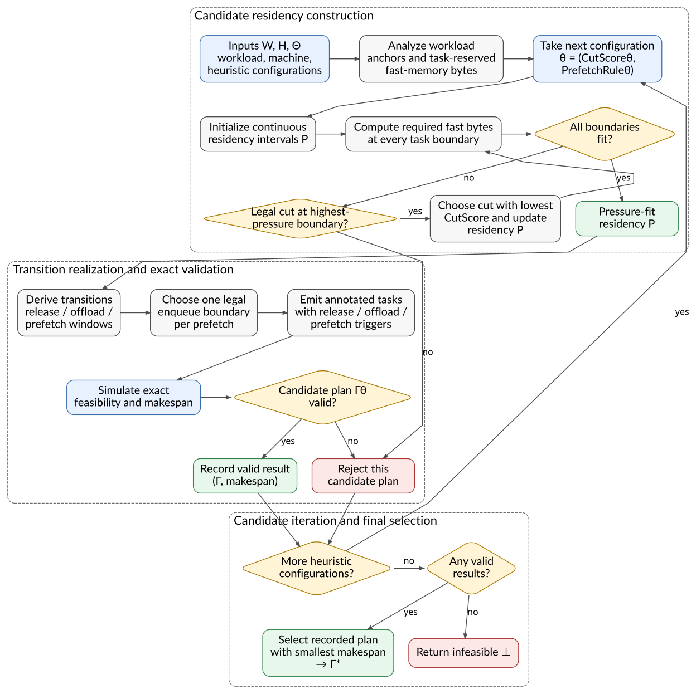

# PressureFit: Algorithm and Implementation Architecture

This note presents PressureFit at three levels. Section A gives a compact,
paper-ready execution model and algorithms independent of this repository.
Section B visualizes the abstract flow. Section C maps those abstractions to
the current `dataflow_sim` implementation.

## Contents

- [A. Formal execution model and algorithms](#a-formal-execution-model-and-algorithms)
  - [A.1 Complete notation](#a1-complete-notation)
  - [A.2 Simulator contract](#a2-simulator-contract)
  - [A.3 PressureFit model](#a3-pressurefit-model)
  - [A.4 PressureFit algorithm](#a4-pressurefit-algorithm)
- [B. Architectural diagram](#b-architectural-diagram)
- [C. Current implementation](#c-current-implementation)
  - [C.1 Public surface](#c1-public-surface)
  - [C.2 Internal data flow](#c2-internal-data-flow)
  - [C.3 Module ownership](#c3-module-ownership)
  - [C.4 Candidate portfolio](#c4-candidate-portfolio)
  - [C.5 Current CutScore heuristics](#c5-current-cutscore-heuristics)
  - [C.6 Current PrefetchRule heuristics](#c6-current-prefetchrule-heuristics)
  - [C.7 Concrete simulator binding](#c7-concrete-simulator-binding)
  - [C.8 Verification, repair, and selection](#c8-verification-repair-and-selection)
  - [C.9 Implementation-only optimizations](#c9-implementation-only-optimizations)
  - [C.10 Tests and quality gates](#c10-tests-and-quality-gates)

## A. Formal execution model and algorithms

| Algorithm | Top-level inputs | Output |
|---|---|---|
| `Simulate` | Annotated plan \(\Gamma\); machine \(\mathcal H\) | Validity and makespan \((v,m)\) |
| `PressureFit` | Workload \(\mathcal W\); machine \(\mathcal H\); heuristic configurations \(\Theta\) | Selected plan \(\Gamma^\star\), or \(\bot\) |

### A.1 Complete notation

The following tables define every symbol and named operation appearing in the
two rendered algorithms. Tuple components are not additional top-level
arguments; they describe the contents of \(\mathcal W\), \(\mathcal H\), and
\(\Gamma\).

| Notation | Definition |
|---|---|
| \(\mathcal T=(\tau_1,\ldots,\tau_n)\), \(d_i\), \(w_i\) | Ordered tasks, and the runtime and opaque task-local workspace bytes of task \(\tau_i\). Each task declares object inputs, outputs, and mutations. The simulator uses \(w_i\); PressureFit receives an object-only projection with \(w_i=0\). |
| \(\mathcal O\), \(o\), \(s_o\) | Movable objects, one object, and its byte size. |
| \(\lambda^0,\lambda^f\) | Initial object locations and required final locations. |
| \(\mathcal W=(\mathcal T,d,\mathcal O,s,\lambda^0,\lambda^f)\) | Complete workload. |
| \(C_{\mathrm P},C_{\mathrm F},C_{\mathrm B}\) | Total program budget, PressureFit's object-only fast-memory capacity, and backing-memory capacity. The caller derives \(C_{\mathrm F}=C_{\mathrm P}-L-\max_i w_i\), where \(L\) is fixed program leeway. |
| \(\beta_{\mathrm{in}},\beta_{\mathrm{out}}\) | Bandwidths into and out of fast memory. |
| \(\mathcal E\) | Deterministic compute/transfer ordering, overlap, allocation, and lifetime semantics. |
| \(\mathcal H=(C_{\mathrm F},C_{\mathrm B},\beta_{\mathrm{in}},\beta_{\mathrm{out}},\mathcal E)\) | Complete machine model. |
| \(\mathcal B=\{0,\ldots,n\}\), \(b\) | Task boundaries and one boundary. Boundary \(0\) precedes all tasks; boundary \(i\) follows \(\tau_i\). |
| \(\mathcal A_o\) | Boundaries at which object \(o\) must reside in fast memory. |
| \(q_b\) | Fresh fast-output bytes that must be reserved at boundary \(b\), outside input-object residency. |
| \(P_o\), \(P\) | Fast-residency intervals for object \(o\), and the mapping for all objects. |
| \(\mathsf{FastBytes}_P(b)\) | Bytes that must fit in fast memory at boundary \(b\): resident objects plus task-reserved bytes. |
| \(\mathbf 1[\cdot]\) | Indicator: \(1\) when its condition is true and \(0\) otherwise. |
| \(g\), \(G\) | One legal removal of optional residency, and the legal cuts at the selected boundary. |
| \(\theta=(\mathsf{CutScore}_\theta,\mathsf{PrefetchRule}_\theta)\), \(\Theta\) | One fixed heuristic configuration and the finite configuration family. Running one \(\theta\) produces at most one candidate plan. |
| \(X\) | Transition plan: initial arrivals, retain/release/offload decisions, and legal prefetch windows. |
| \(X_{\mathrm{pre}}\subseteq X\), \(x\) | Prefetch transitions in \(X\), and one such transition. |
| \(\mathsf{Window}(x)\subseteq\mathcal B\setminus\{0\}\) | Task-completion boundaries at which prefetch \(x\) may legally be enqueued. |
| \(\phi:X_{\mathrm{pre}}\to\mathcal B\) | One concrete enqueue boundary per prefetch, satisfying \(\phi(x)\in\mathsf{Window}(x)\). |
| \(\Gamma\) | Emitted workload whose tasks carry release/offload/prefetch annotations; this is what the simulator replays. |
| \(\Sigma\) | Mutable event-simulation state: time, live objects, dirty state, task position, and resource queues. |
| \(v\), \(m\) | Simulator validity and makespan; invalid plans return \((\mathsf{false},\infty)\). |
| \(\Gamma^\star\), \(m^\star\), \(\bot\) | Best plan found, its makespan, and the infeasible/no-plan sentinel. |

| Named operation | Meaning |
|---|---|
| \(\mathsf{Analyze}(\mathcal W)\) | Derive \((\mathcal B,\mathcal A,q)\) from task declarations and placement requirements. |
| \(\operatorname{Hull}(\mathcal A_o)\) | Smallest continuous interval containing all required boundaries of \(o\). |
| \(\mathsf{LegalCuts}(P,b)\) | Cuts through \(b\) that preserve required residency and admit correct write-back/reload transitions. |
| \(\mathsf{Cut}(P,g)\) | Remove the interval selected by \(g\) from \(P\). |
| \(\mathsf{CutScore}_\theta(g;\mathcal W,\mathcal H,P,b)\) | Estimate the local preference for removing legal residency gap \(g\) in the current context, returning a totally ordered key; lower is preferred. |
| \(\mathsf{Transitions}(\mathcal W,P)\) | Derive initial arrivals, retain/release/offload decisions, and legal prefetch windows from residency gaps. |
| \(\mathsf{PrefetchRule}_\theta(\mathcal W,\mathcal H,P,X)\) | Return \(\phi\) by selecting one enqueue boundary inside every prefetch window; it does not choose release versus offload or predict actual transfer start time. |
| \(\mathsf{Emit}(\mathcal W,X,\phi)\) | Attach initial-copy and release/offload/prefetch annotations to workload tasks, producing \(\Gamma\). |
| \(\mathsf{Simulate}(\Gamma;\mathcal H)\) | Replay \(\Gamma\) on \(\mathcal H\) and return \((v,m)\). |
| \(\mathsf{StaticValid}(\Gamma)\) | Check plan structure before event replay. |
| \(\mathsf{Initialize}(\Gamma,\mathcal H)\) | Construct initial simulation state \(\Sigma\). |
| \(\mathsf{Ready}(\Sigma,\tau)\) | Test whether inputs are current in fast memory and outputs plus task-local workspace fit. |
| \(\mathsf{AdvanceNextEvent}(\Sigma,\mathcal H)\) | Commit the next deterministic transfer event; return false on deadlock. |
| \(\mathsf{ExecuteTask}(\Sigma,\tau,\mathcal H)\) | Reserve outputs, charge workspace for the task lifetime, run \(\tau\) while transfers progress, commit results, release workspace, and enqueue annotations. |
| \(\mathsf{TransfersPending}(\Sigma)\) | Test whether either directional transfer stream has unfinished work. |
| \(\mathsf{FinalStateValid}(\Sigma)\) | Check required final locations and clean/dirty state. |
| \(\mathsf{Makespan}(\Sigma)\) | Latest compute or transfer completion time. |

### A.2 Simulator contract

PressureFit plans against an abstract event-driven machine rather than a
particular simulator implementation. The machine has three independently
progressing, single-server resources:

1. one compute stream, which executes tasks in declared order;
2. one inbound FIFO transfer stream into fast memory; and
3. one outbound FIFO transfer stream into backing memory.

The two transfer streams may overlap each other and compute. Within a transfer
stream, no request may bypass an earlier request. Transfer duration is
\(\lceil s_o/\beta_r\rceil\) on resource \(r\), unless the annotated schedule
supplies an explicit duration. A fixed total event order is part of the
execution semantics \(\mathcal E\), so simultaneous completions never depend
on container or thread iteration order. Collect the machine parameters as

\[
\mathcal H=(C_{\mathrm F},C_{\mathrm B},
\beta_{\mathrm{in}},\beta_{\mathrm{out}},\mathcal E).
\]

An object is **dirty** when its latest fast-memory bytes are not represented by
a current backing-memory copy, either because it was produced or because a
task mutated it after the last write-back. A dirty object must be written back
before its fast copy can be discarded and later reloaded. For example, if
\(W\) exists in both memories and a task updates the fast copy, the backing
copy is stale; offloading the updated \(W\) makes the backing copy current
again. These are ordinary clean/dirty-copy semantics—there are no explicit
user-managed version numbers.

#### Admission and memory semantics

- A task starts when its inputs are live in fast memory and its outputs plus
  opaque task-local workspace fit. Output storage is reserved at task start and
  becomes live at completion; workspace is charged only during execution and
  is then released. It is neither a persistent object nor a transfer target.
- Post-task annotations release objects or enqueue transfers. A queued transfer
  reserves its destination only when it reaches the FIFO head and starts; a
  blocked head cannot be bypassed.
- Transfer sources remain allocated until completion. Completion makes the
  copied value current at the destination and, for outbound movement, frees
  the fast source.
- Replay continues until all tasks and transfers finish. Capacity deadlock,
  missing or stale inputs, or invalid final placement make the plan
  invalid.

These rules maintain

\[
M_{\mathrm F}(t)\le C_{\mathrm F},\qquad
M_{\mathrm B}(t)\le C_{\mathrm B},
\]

at most one active transfer per directional stream, declared task order,
current-fast-copy consumption, and correct clean/dirty state for every object.
`Simulate` returns \((\mathsf{true},m)\), where \(m\) is the latest
compute or transfer completion, or \((\mathsf{false},\infty)\) on a structural
violation, capacity deadlock, missing input, stale source, or invalid final
placement.


[LaTeX source](pressurefit_algo_assets/pressurefit_simulator.tex) ·
[PDF](pressurefit_algo_assets/pressurefit_simulator.pdf)

`AdvanceNextEvent` commits the earliest deterministic transfer event.
`ExecuteTask` reserves outputs, charges task-local workspace, advances the task
together with independent transfers, releases workspace, commits task results,
and enqueues its post-task annotations. These subroutines preserve the
semantics above.

### A.3 PressureFit model

PressureFit receives an object-only projection of the executable workload.
Its fast capacity is conservatively derived before the algorithm runs:

\[
C_{\mathrm F}=C_{\mathrm P}-L-\max_i w_i.
\]

All projected task workspaces are zero. Candidate simulation therefore checks
object residency and movement only. After selection, the implementation
restores \(w_i\) and performs a final ordinary simulation at capacity
\(C_{\mathrm P}-L\); the returned executable plan retains that capacity.
This wrapper-level validation is equivalent to enforcing
objects plus active workspace plus leeway within the total program budget; it
is not part of the core residency algorithm.

Consider an ordered computation
\(\mathcal{T}=(\tau_1,\ldots,\tau_n)\) and the boundary set
\(\mathcal{B}=\{0,\ldots,n\}\), where boundary \(0\) precedes the first
task and boundary \(i\) follows task \(\tau_i\).

A residency plan \(P\) maps every object to disjoint intervals over
\(\mathcal B\). Its pressure at boundary \(b\) is

\[
\mathsf{FastBytes}_P(b)=q_b+\sum_{o\in\mathcal O}s_o
\mathbf 1\!\left[b\in P_o\right].
\]

The seed \(P^0_o=\operatorname{Hull}(\mathcal A_o)\) is the smallest continuous
interval covering all anchors of \(o\); an object without anchors has an empty
seed. A candidate cut \(g=(o,[\ell,r])\) removes an anchor-free subinterval
from one current interval of \(o\), possibly splitting it into two pieces.
Let \(\mathsf{LegalCuts}(P,b)\) be the executable cuts whose removed interval
contains \(b\), and define
\(\operatorname{Hull}(\varnothing)=\varnothing\).
\(\mathsf{Transitions}(\mathcal W,P)\) derives initial arrivals, whether each
residency exit retains, releases, or writes back (`offload`) the object, and
the legal window for every later prefetch. For a candidate annotated schedule
\(\Gamma\),

\[
\mathsf{Simulate}(\Gamma;\mathcal H)=(v,m)
\]

returns physical validity \(v\) and makespan \(m\). The execution semantics
\(\mathcal E\) are explicit because bandwidth alone does not determine
makespan: replay must also know which resources serialize, what may overlap,
and when source and destination storage becomes live.

#### Plan space and output

A candidate plan is constructed as

\[
X=\mathsf{Transitions}(\mathcal W,P),\quad
\phi_\theta=\mathsf{PrefetchRule}_\theta(\mathcal W,\mathcal H,P,X),\quad
\Gamma_\theta(P)=\mathsf{Emit}(\mathcal W,X,\phi_\theta),
\]

where \(P\) gives residency intervals, \(X\) determines departure actions and
prefetch windows, and \(\phi_\theta\) chooses exactly one enqueue boundary per
prefetch. Enqueueing inserts the request into the inbound FIFO; the transfer
may start later if earlier requests or destination capacity block it.
`Emit` materializes every initial-copy, release, offload, and prefetch
annotation. \(\Gamma\) remains a static annotation of the unchanged
computation; timestamps are produced only by `Simulate`. The explored plan
space is

\[
\mathfrak P_\Theta=
\{\Gamma_\theta(P):\theta\in\Theta,\ P\preceq_{\rm cut}P^0,\
\mathcal A_o\subseteq P_o,\ \mathsf{FastBytes}_P(b)\le C_{\mathrm F}\},
\]

where \(P\preceq_{\rm cut}P^0\) means that \(P\) is reachable from \(P^0\) by
legal cuts. The output \(\Gamma^\star\) is any simulator-valid plan in
\(\mathfrak P_\Theta\) whose makespan is no greater than that of any other
valid candidate, or \(\bot\) if no candidate is valid. Thus PressureFit
optimizes over the bounded space generated by \(\Theta\), not over every
possible annotation.

### A.4 PressureFit algorithm


[LaTeX source](pressurefit_algo_assets/pressurefit_algorithm.tex) ·
[PDF](pressurefit_algo_assets/pressurefit_algorithm.pdf)

\(\Theta\) is an extensible input portfolio, not a fixed enum. A
**heuristic configuration** \(\theta\) fixes both hooks for one complete planner
run; that run emits one **candidate plan** \(\Gamma_\theta\), or fails to emit a
valid plan. The hooks have deliberately different responsibilities:

| Hook | Input | Output | Decision |
|---|---|---|---|
| \(\mathsf{CutScore}_\theta\) | One legal cut \(g\), workload and machine, current residency \(P\), and over-capacity boundary \(b\) | Any totally ordered lower-is-better key | Which optional residency gap to remove next. |
| \(\mathsf{PrefetchRule}_\theta\) | Workload and machine, completed residency \(P\), and all transitions \(X\) | Mapping \(\phi\) selecting one legal enqueue boundary per prefetch | Which task completion enqueues each already-required prefetch. |

Both hooks are heuristic. `CutScore` is invoked repeatedly while constructing
\(P\); `PrefetchRule` runs after that residency plan determines the full
set of movement obligations, allowing it to coordinate across reloads. Neither
hook establishes physical feasibility or actual makespan—`Simulate` does.
New cut scores and prefetch rules can therefore be added independently.
The current implementation portfolio is documented in Sections C.4–C.6 and
in [`pressurefit.md`](pressurefit.md).

`Simulate` is an essential subroutine rather than an optional post-check. The
boundary-pressure model deliberately abstracts exact FIFO timing, overlap, and
in-flight allocation lifetimes. Consequently, an analytic candidate is never
returned without simulation, and candidate makespans are compared only after
the same execution model has validated them.

The central invariants are:

1. **Anchor preservation:** every \(b\in\mathcal A_o\) remains covered by
   \(P_o\).
2. **Monotone reduction:** \(P_o\subseteq P^0_o\); the algorithm never invents
   residency outside the seed.
3. **Executable gaps:** every cut has a correct departure and later re-entry
   path.
4. **Analytic capacity:** a realized candidate satisfies
   \(\mathsf{FastBytes}_P(b)\le C_{\mathrm F}\) for every boundary before
   replay.
5. **Simulator admissibility:** the returned \(\Gamma^\star\) is valid under
   \(\mathcal H\) and has the
   minimum simulated makespan among valid candidates in \(\Theta\).
6. **Finite termination:** every accepted cut removes at least one
   object-boundary residency pair, and the seed contains finitely many such
   pairs.

PressureFit is greedy rather than globally optimal: each \(\mathsf{CutScore}_\theta\)
chooses a locally preferred legal pressure reduction. Its contribution is the
conversion of a memory-capacity problem into deterministic,
anchor-preserving interval cuts whose gaps define data movement, followed by
simulation-backed feasibility and makespan selection over a bounded candidate
family.

## B. Architectural diagram



[Graphviz source](pressurefit_algo_assets/pressurefit_architecture.dot) ·
[PDF](pressurefit_algo_assets/pressurefit_architecture.pdf)

The upper feedback edge performs greedy pressure reduction for one candidate
rule. The lower feedback edge is equally important: an unreducible or
simulator-invalid candidate is rejected, a valid candidate is recorded, and
both paths continue with the next \(\theta\). Only after \(\Theta\) is exhausted
does PressureFit select the recorded valid plan with minimum makespan, or
return \(\bot\) when none is valid.

## C. Current implementation

### C.1 Public surface

The implementation consumes and returns the framework-neutral simulator
schema; PressureFit does not inspect tensor metadata, model families, task
names, or object names.

| Surface | Contract |
|---|---|
| `pressurefit(bare, *, fast_memory_capacity=None, preplace="greedy", prefetch_rules=None, program_leeway_bytes=0)` | Algorithm-shaped core: derive object capacity, select the annotated chain, restore workspaces, and return diagnostics. |
| `apply_pressurefit_policy(bare, *, fast_memory_capacity=None, preplace="greedy", prefetch_rules=None, program_leeway_bytes=0)` | Return the selected annotated `TaskChain`. `prefetch_rules` optionally restricts the implementation portfolio by exact rule name. |
| `plan_pressurefit_policy(...)` | Policy-convention wrapper returning `(annotated_chain, diagnostics)`. |
| `TaskChain` | Ordered tasks, initial objects, final locations, transfer bandwidths, and fast-memory capacity. |
| `Task` | Runtime, opaque task-local workspace bytes, object inputs/outputs, mutations, and emitted release/offload/prefetch triggers. PressureFit restores workspace after object planning; the simulator enforces it. |
| `Object` | Opaque identifier, byte size, and location. `Object.type` is preserved but never used for planning. |

The entry points live in
[`pressurefit.py`](../../../src/dataflow_sim/policies/pressurefit.py).

### C.2 Internal data flow

The repository realizes the abstract algorithm as this pipeline:

```text
TaskChain
  -> derive object capacity; zero task workspaces
  -> pressurefit: Analyze + seed residency
  -> _PressureReducer: CutScore-guided residency
  -> _verify_candidate
       -> optional residency refinement
       -> _build_transitions       -> _TransitionPlan
       -> _apply_prefetch_rule     -> _PrefetchAssignments
       -> _emit_chain              -> annotated TaskChain
       -> object-only simulator replay
       -> optional pressure repair and re-reduction
  -> minimum-makespan valid candidate
  -> restore task workspaces; final replay at total budget - leeway
  -> annotated TaskChain + PressureFitDiagnostics
```

Static-arena deployment performs a separate post-policy feedback step:
physicalize the annotated chain, measure its exact packed extent, and feed any
budget excess back as a reduced PressureFit capacity. This is intentionally not
part of the research-paper PressureFit algorithm: it is an executor-layout
constraint. The implementation first retries the selected task/recompute
variant and invokes the full recompute search only if that variant has no valid
reduced-capacity placement.

| Internal type | Role |
|---|---|
| `_Facts` | Immutable derived task/object facts: sizes, producers, uses, mutators, boundary times, output reservations, and bandwidths. |
| `_ResidencyAnchor` | Typed mandatory boundary: initial, producer, use, or final-fast. |
| `_ResidencySpan` | Inclusive fast-residency interval in implementation boundary coordinates. |
| `_IntervalSet` | Object-ID-to-spans map; the mutable working state of pressure reduction. |
| `_SplitOption` | One currently executable interval cut and its deterministic rank. |
| `_ResidencyTransition` | Version-aware arrival and departure semantics for one span. |
| `_TransitionPlan` | Categorized preplacement, prefetch, and departure decisions consumed by rule application and emission; omitted departure means retain. |
| `_PrefetchWindow` | Earliest/latest trigger bounds and the relevant consumer for one re-entry. |
| `_PrefetchAssignments` | One ordered tuple of object IDs per task-completion enqueue boundary. |
| `_ResidencySpec` | One pressure view, `CutScore` choice, and stopping rule. |
| `_PrefetchRuleSpec` | One exact name, one of four base boundary-selection rules, and the clean-gap normalization choice. |
| `PressureFitDiagnostics` | Selected candidate plus per-candidate validity, makespan, and planner wall time. |

The mathematical document numbers boundaries \(0\ldots n\). Internally,
PressureFit uses \(-1\ldots n-1\): `-1` is the initial state and boundary `i`
is immediately after task `i`. This is only a coordinate shift.

### C.3 Module ownership

| File | Responsibility |
|---|---|
| [`pressurefit.py`](../../../src/dataflow_sim/policies/pressurefit.py) | Algorithm-shaped `pressurefit` spine, public policy wrappers, bounded portfolio orchestration, fastest-valid selection, and exact lower-bound termination. |
| [`candidate.py`](../../../src/dataflow_sim/policies/pressurefit_aux/candidate.py) | One candidate's residency refinement, `Transitions → PrefetchRule → Emit` realization, simulator verification, and bounded physical repair. |
| [`types.py`](../../../src/dataflow_sim/policies/pressurefit_aux/types.py) | Typed private records for residency strategies, prefetch rules, spans, anchors, prefetch windows, and transitions. |
| [`core.py`](../../../src/dataflow_sim/policies/pressurefit_aux/core.py) | `_Facts`, anchor derivation, boundary byte accounting, and common timing helpers. |
| [`seeds.py`](../../../src/dataflow_sim/policies/pressurefit_aux/seeds.py) | Initial fast-memory selection and seed interval construction. |
| [`reducer.py`](../../../src/dataflow_sim/policies/pressurefit_aux/reducer.py) | Greedy worst-boundary pressure reduction and `CutScore` evaluation. |
| [`transitions.py`](../../../src/dataflow_sim/policies/pressurefit_aux/transitions.py) | Executable arrival/departure construction and backing-copy freshness. |
| [`residency_refinement.py`](../../../src/dataflow_sim/policies/pressurefit_aux/residency_refinement.py) | Optional interval-entry lead-time extension; the only implementation step that refines completed pressure-fit residency. |
| [`prefetch_rules.py`](../../../src/dataflow_sim/policies/pressurefit_aux/prefetch_rules.py) | Prefetch jobs and the four enqueue-boundary heuristics, including FIFO packing and capacity clamping. |
| [`emit.py`](../../../src/dataflow_sim/policies/pressurefit_aux/emit.py) | Pure conversion of a transition plan and prefetch assignments into `TaskChain` annotations. |
| [`physical_repair.py`](../../../src/dataflow_sim/policies/pressurefit_aux/physical_repair.py) | Translation of structured simulator capacity failures into additional boundary pressure. |
| [`diagnostics.py`](../../../src/dataflow_sim/policies/pressurefit_aux/diagnostics.py) | Public diagnostic records and candidate-result construction. |
| [`engine/errors.py`](../../../src/dataflow_sim/engine/errors.py) | Structured, `ValueError`-compatible capacity failures used by repair. |

Dependency direction is intentionally one-way:

```text
pressurefit.py
  -> seeds / reducer / candidate / diagnostics
candidate
  -> residency_refinement / transitions / prefetch_rules / emit / repair
  -> simulator
auxiliary modules
  -> core / types
```

No auxiliary module calls the public planner, and the simulator has no
dependency on PressureFit.

### C.4 Candidate portfolio

The paper algorithm leaves the pressure view, cut score, and concrete
prefetch-trigger assignment abstract. The current implementation evaluates a bounded,
deterministic portfolio rather than claiming one local choice dominates all
workloads:

The abstract \(\theta\) fixes the required `CutScore` and `PrefetchRule`
hooks. Internally, the current implementation enriches that configuration
with pressure-view, stopping, and clean-gap-coalescing choices. Those extra
portfolio dimensions are implementation strategies, not additional abstract
hook requirements.

- five residency strategies combine conservative or capacity-tight pressure,
  stall- or transfer-oriented `CutScore`, and strict or relaxed stopping;
- four `PrefetchRule` heuristics are evaluated in ordinary and
  clean-gap-coalesced forms;
- therefore at most \(5\times 8=40\) candidates are replayed.

| Portfolio dimension | Concrete options |
|---|---|
| Pressure view and stopping rule | `headroom-stall`, `headroom-transfer`, `tight-stall`, `tight-transfer`, `relaxed-stall` |
| Cut score | `min-stall`, `min-transfer` |
| Prefetch rule | `packed-fifo`, `packed-fit`, `interval-entry`, `latest-safe` |
| Clean-gap coalescing | Disabled or enabled for each `PrefetchRule` |

Sections C.5 and C.6 define every current `CutScore` and `PrefetchRule` by
exact implementation name. They are implementation choices around the core
interval-cut algorithm, not extra requirements of the mathematical
formulation.

### C.5 Current `CutScore` heuristics

A cut removes one anchor-free gap from an object's fast-residency interval.
Every boundary in that gap is relieved by the object's full size \(s_o\), but
the gap may require the current bytes to be written to backing memory and
later reloaded. PressureFit first rejects cuts that cannot produce legal
release/write-back/reload transitions; the score ranks only the remaining
executable cuts that relieve the currently selected pressure boundary.

The cut score is a local greedy preference, not a prediction of a
candidate's final makespan. The current implementation uses two lexicographic
scores with deliberately different objectives.

#### Why more than one `CutScore` is necessary

A legal cut has at least two costs that cannot be reduced to one
workload-independent ordering:

1. **exposed latency:** whether the object's next consumer must wait for the
   resulting write-back/reload; and
2. **transfer work:** whether the cut creates an outbound write-back and adds
   contention to the movement streams.

These costs can disagree. Consider a memory-pressure boundary at which either
of two saved activations can be removed:

| Legal cut | Backing state | Time until next use | Local consequence |
|---|---|---:|---|
| Activation (A) | Clean backing copy already exists | 2 ms | No write-back, but a 4 ms reload exposes about 2 ms of delay. |
| Activation (B) | Latest value is dirty | 20 ms | Requires a write-back and later reload, but both can fit behind intervening compute. |

`min-transfer` prefers (A): it avoids creating an outbound transfer.
`min-stall` prefers (B): its additional movement is locally hideable, while
cutting (A) delays the next consumer. In this geometry, the stall-oriented
choice can finish earlier despite moving more bytes.

The preference can reverse without changing which cuts are legal. If the
outbound stream is already busy with mandatory gradient or activation
write-backs, (B)'s nominally hidden write-back can delay several later
transfers. Paying (A)'s small isolated reload stall may then produce the
shorter complete schedule. `min-stall` does not model this global queue
interaction, while `min-transfer` deliberately avoids adding that work.

This is why the two scores are raced rather than combined with a fixed numeric
weight. The correct exchange rate between one unit of exposed latency and one
additional transfer depends on compute gaps, directional bandwidths, queue
contention, and the later prefetch placements. Those facts become exact only
after all cuts have been chosen and `Simulate` evaluates the complete plan.

| Exact name | Primary decision | Purpose | Target scenario | Used by residency strategies |
|---|---|---|---|---|
| `min-stall` | Minimize estimated exposed delay at the next use, then outbound work. | Prefer cuts whose required write-back/reload can be hidden by available compute time. | Tight memory with latency-sensitive reuse, especially when a poorly placed cut would stall the next consumer. | `headroom-stall`, `tight-stall`, `relaxed-stall` |
| `min-transfer` | Minimize outbound write-back work before considering reuse timing. | Prefer clean releases or dropped initial placement and avoid creating unnecessary slow-memory traffic. | Transfer-constrained workloads where extra write-backs are costly and several legal cuts provide similar pressure relief. | `headroom-transfer`, `tight-transfer` |

Both names identify lower-is-better lexicographic keys, not predicted
makespans. They rank only legal cuts that relieve the selected over-capacity
boundary; exact candidate quality is determined later by `Simulate`.
The exact-name type is `_CutScoreKind` in
[`types.py`](../../../src/dataflow_sim/policies/pressurefit_aux/types.py), and
[`_PressureReducer._ranked_split_option`](../../../src/dataflow_sim/policies/pressurefit_aux/reducer.py)
constructs the corresponding key. These are internal heuristic choices, not
separate public planner entry points.

\[
\begin{aligned}
\mathsf{CutScore}_{\mathrm{min\text{-}transfer}}
  &= (w,\iota,-u,-s_o,-L),\\
\mathsf{CutScore}_{\mathrm{min\text{-}stall}}
  &= (\delta,w,\iota,-u,-s_o,-L).
\end{aligned}
\]

Lexicographic comparison minimizes the first component, then the next, and so
on. The components are:

| Component | Implementation meaning |
|---|---|
| \(\delta\) | Estimated unavoidable delay at the next consumer. It compares the earliest ideal reload completion against that consumer's task-start deadline. |
| \(w\in\{0,1\}\) | Outbound write-back work: \(0\) if a current backing copy permits a clean release, and \(1\) if the latest bytes must first be offloaded. |
| \(\iota\in\{0,1\}\) | Initial-residency indicator: \(0\) when the cut drops initial fast placement, otherwise \(1\). |
| \(u\) | Object's first-use task index; later first use is preferred. |
| \(s_o\) | Object size; larger objects relieve more bytes at the selected boundary. |
| \(L\) | Number of boundaries removed from residency; longer gaps relieve pressure for longer. |

For \(\delta\), the reducer estimates when the reload can finish from the
earliest legal trigger, directional bandwidths, and—when \(w=1\)—the time at
which the preceding write-back makes the source available. The estimate does
not model contention from other queued transfers, destination-allocation
blocking, or the final `PrefetchRule`. Those effects depend on all
cuts together and are handled only after a complete candidate has been built.

`min-transfer` therefore favors avoiding outbound write-backs, while
`min-stall` first favors gaps whose idealized movement can be hidden before
the next use. The other fields guide pressure relief when those primary terms
do not distinguish the choices. After reduction, `PrefetchRule` application
and emission construct the full annotation, and `Simulate` determines feasibility and
makespan.

### C.6 Current `PrefetchRule` heuristics

Every rule receives the completed residency plan and its legal prefetch
windows, then chooses exactly one task-completion boundary at which each
prefetch request is enqueued. A rule does not choose the transfer's actual
start time: the simulator's inbound FIFO and capacity admission determine
that.

#### Why more than one `PrefetchRule` is necessary

Choosing an earlier trigger is not uniformly better or worse. It gives a
reload more opportunity to overlap compute and to get ahead of other FIFO
requests, but the destination occupies fast memory as soon as the transfer
actually starts. That earlier occupancy can prevent an intermediate task from
allocating its output. Conversely, a late trigger conserves memory but may
leave too little FIFO service time before the consumer. Three independent
effects therefore matter:

- **FIFO contention:** every request is legal by itself, yet several
  individually just-in-time requests cannot all complete just in time on one
  serialized inbound stream;
- **destination pressure:** an early request may begin immediately and keep
  its destination resident across memory-critical intermediate tasks; and
- **lead-time representation:** safely moving an interval entry earlier makes
  the extra residency explicit and pressure-checked, rather than merely
  enqueueing a request early and relying on runtime backpressure.

Minimal workload patterns show why the rules are not ordered by quality:

| Pattern | Rule that addresses it | Why one simpler choice loses |
|---|---|---|
| Two activation reloads each take 4 ms and their consumers are only 1 ms apart. Each reload appears feasible when the inbound stream is assumed idle. | `packed-fifo` | Independent `latest-safe` placement can enqueue both near their own deadlines; the first occupies the FIFO and the second misses its consumer. Backward FIFO packing reserves service time for both. |
| A chain has 6 GiB retained under a 10 GiB cap, a 3 GiB activation reload, and an intervening task that must allocate a 2 GiB output. | `packed-fit` | An early reload fits by itself but leaves 9 GiB resident, so the next output cannot fit. `packed-fit` delays the trigger past that pressure region. If an older FIFO request would have prevented the reload from actually starting there, however, the unclamped early enqueue is safe and preserves queue position; the static clamp can be unnecessarily conservative. This is why `packed-fifo` also remains in the portfolio. |
| A long activation reload has ample compute time and free capacity several tasks before its use, but the pressure-reduced interval begins close to that use. | `interval-entry` | Extending the interval entry buys and explicitly charges safe lead time. A purely late independent trigger does not express that earlier residency, while aggressive FIFO packing may enqueue early without the same analytic capacity proof. |
| Only one reload is pending and every byte of fast memory is needed by the intervening task outputs. | `latest-safe` | FIFO coordination provides no benefit; retaining or materializing the destination early can block compute. The latest individually feasible trigger minimizes occupancy. |

The same tension explains the ordinary and `-coalesced` variants. If a clean
object is released and restored at the same boundary, retaining it removes a
redundant round trip. Retention still consumes fast memory continuously,
however, and can make a tight candidate infeasible where the ordinary
release/reload form succeeds because transfer admission is deferred. Both
forms are therefore simulator-verified rather than assuming coalescing always
improves a plan.

No single rule observes all three effects exactly: doing so would require
running the event-driven simulator while searching the combinatorial space of
all trigger assignments. PressureFit instead evaluates four inexpensive,
deliberately biased constructions and lets one exact replay per completed
candidate decide feasibility and makespan. The current implementation exposes
eight exact names:

| Exact name | Boundary-selection behavior | Purpose | Target scenario |
|---|---|---|---|
| `packed-fifo` | Packs prefetches backward from consumer deadlines while modeling them as one ordered inbound FIFO. | Coordinate several reloads so a late request is not trapped behind earlier FIFO work. | Inbound congestion dominates and enough fast-memory headroom exists for early arrivals. |
| `packed-fit` | Starts from FIFO packing, then moves a trigger later until the additional early-residency bytes fit the analytic capacity model. | Preserve FIFO coordination without analytically overcommitting destination memory. | Tight budgets where `packed-fifo` may start a transfer early enough to block a later task output. |
| `interval-entry` | Extends residency entries earlier where strict pressure permits, then chooses a trigger intended to complete by the extended entry. | Create transfer lead time that the original pressure-fit interval did not expose. | Long transfers need more overlap, but there is safe capacity before the first required-use boundary. |
| `latest-safe` | Chooses the latest individually feasible trigger in each legal window, assuming no other inbound queue work. | Minimize early destination occupancy. | Extreme memory pressure matters more than coordinating multiple inbound transfers. |
| `packed-fifo-coalesced` | Applies `packed-fifo`, then removes a clean same-boundary release/reload pair by retaining the object continuously. | Avoid a provably redundant clean round trip. | FIFO-congested cases containing zero-width clean gaps that continuous residency can absorb. |
| `packed-fit-coalesced` | Applies `packed-fit` with the same clean-gap normalization. | Combine capacity-clamped packing with removal of redundant clean transfers. | Tight-capacity FIFO cases where coalescing still passes exact simulator replay. |
| `interval-entry-coalesced` | Applies `interval-entry` with the same clean-gap normalization. | Preserve lead-time extension while eliminating redundant clean release/reload pairs. | Lead-time-sensitive cases containing clean adjacent spans. |
| `latest-safe-coalesced` | Applies `latest-safe` with the same clean-gap normalization. | Minimize early occupancy while retaining across clean zero-width gaps. | Very tight budgets where conservative triggers and selective clean-gap retention are both useful. |

The portfolio records live in `_PREFETCH_RULES` in
[`pressurefit.py`](../../../src/dataflow_sim/policies/pressurefit.py).
[`prefetch_rules.py`](../../../src/dataflow_sim/policies/pressurefit_aux/prefetch_rules.py)
implements FIFO packing, capacity clamping, and individual trigger selection.
The `interval-entry` residency extension is isolated in
[`residency_refinement.py`](../../../src/dataflow_sim/policies/pressurefit_aux/residency_refinement.py),
and [`emit.py`](../../../src/dataflow_sim/policies/pressurefit_aux/emit.py)
only serializes the resulting transition plan and assignments.

Coalescing is legal only when the backing copy is already current. A dirty
`offload`/`prefetch` pair is never coalesced, and every coalesced candidate is
still simulator-verified.

### C.7 Concrete simulator binding

[`simulator.py`](../../../src/dataflow_sim/engine/simulator.py) instantiates the
abstract contract in Section A.2. `TaskChain` supplies task runtimes, both
capacities, both bandwidths, initial/final locations, and the annotated
release/offload/prefetch triggers.

| Abstract rule | Current realization |
|---|---|
| Three single-server resources | Ordered compute plus independent `from_slow` and `to_slow` FIFO streams. |
| Transfer duration | Trigger override when present; otherwise `max(ceil(size / bandwidth), 1)`. |
| Destination reservation | Deferred until the request reaches the FIFO head and actually starts. A blocked head is never bypassed. |
| Task admission | Every input must be `live` in fast memory and every fast output must fit; scheduled outbound completions may unblock admission. |
| Task completion | Outputs become `live`, releases execute, then outbound and inbound triggers enqueue. |
| Outbound lifetime | Fast source remains allocated through completion; backing destination is reserved at start and becomes current at completion. |
| Inbound lifetime | Backing source remains present; fast destination is reserved at start and becomes `live` at completion. |
| Write-back/readback hazard | A prefetch fired while the same object is being written back is deferred until that write-back completes. |
| Simultaneous transfer completion | `from_slow` completes before `to_slow`; this deterministic tie rule is part of the current \(\mathcal E\). |
| Abstract `(valid, makespan)` | Successful replay returns intervals whose maximum end is the makespan; validation/runtime exceptions mean invalid. |

PressureFit uses the snapshot-free scoring path, which skips UI event snapshots
but preserves the same task/transfer intervals, capacity behavior, and
makespan.

### C.8 Verification, repair, and selection

For each candidate, the implementation:

1. builds clean/dirty-correct `_ResidencyTransition` records;
2. places inbound transfers and emits a fresh annotated `TaskChain`;
3. relies on ordinary schema validation to reject structural contradictions;
4. runs the event-driven simulator to determine physical feasibility and
   makespan;
5. if a structured capacity failure identifies a repairable boundary, adds
   the observed pressure, re-runs reduction, and retries within a fixed bound;
6. returns the fastest valid candidate, with stable portfolio order breaking
   equal-makespan ties.

The simulator is the physical arbiter because static boundary pressure does
not fully encode FIFO transfer timing or the exact lifetime of in-flight
copies. If a verified candidate reaches the serialized compute-only makespan,
candidate evaluation stops: that value is a global lower bound for an ordered
task chain.

### C.9 Implementation-only optimizations

The following improve planner wall time without altering the algorithmic
contract:

- range-add difference arrays form boundary pressure;
- sorted event tuples and binary search answer producer/use/mutation queries;
- boundary membership and split candidates are indexed once;
- repeated cuts at one boundary reuse unchanged objects' split results;
- backing-copy freshness is cached for candidate evaluation;
- candidates are streamed while retaining only the best legal split; and
- portfolio evaluation stops after simulator-verified equality with the
  compute-only lower bound.

These mechanisms do not belong in the paper pseudocode: they preserve the same
anchors, legal cuts, deterministic ranking, and selected plan.

### C.10 Tests and quality gates

| Concern | Location |
|---|---|
| Policy behavior, candidate enumeration, repair, determinism, and lower-bound stopping | [`test_pressurefit.py`](../../../tests/dataflow_sim/planning/policies/test_pressurefit.py) |
| Simulator capacity-error contract | [`test_simulator.py`](../../../tests/dataflow_sim/engine/test_simulator.py) |
| Tiny-chain exhaustive optimality checks | [`test_pressurefit_exact_oracle.py`](../../../tests/dataflow_sim/planning/test_pressurefit_exact_oracle.py) |
| Reproducible cross-version quality and wall-time methodology | [`pressurefit-quality.md`](pressurefit-quality.md) |

PressureFit remains a verified bounded heuristic. The exhaustive tiny-chain
oracle and cross-version harness measure approximation gap and regression risk;
they are development tools and do not participate in production planning.
